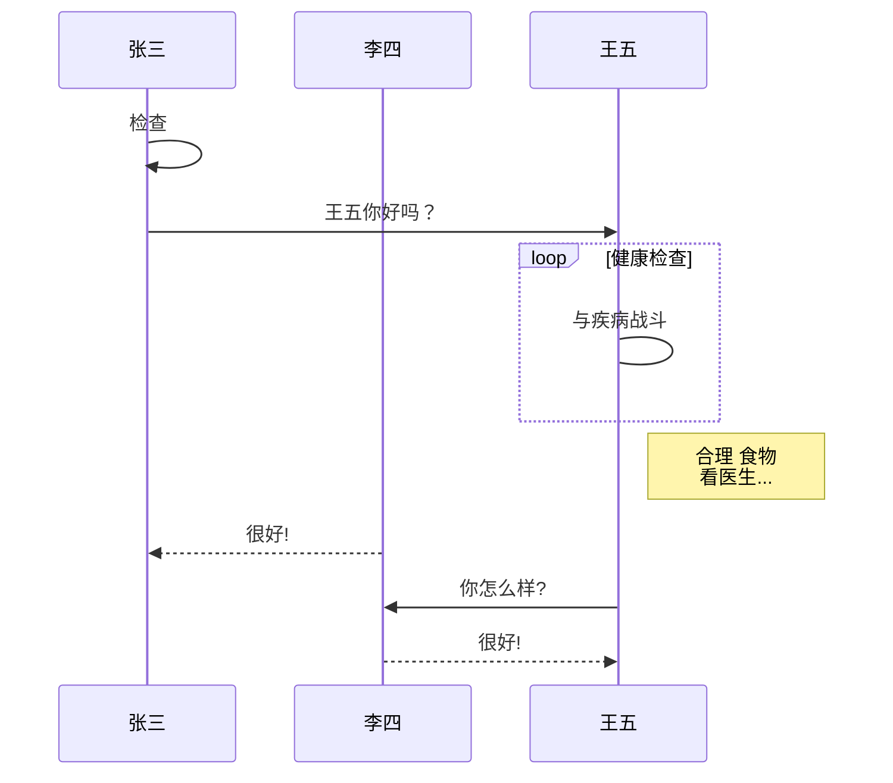
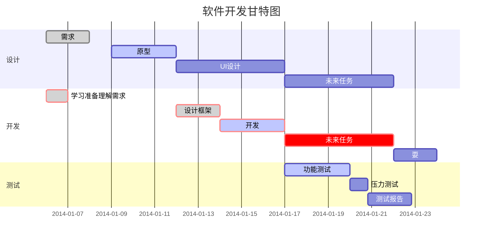

# study
<head> 
<script defer src="https://use.fontawesome.com/releases/v5.0.13/js/all.js"></script> 
<script defer src="https://use.fontawesome.com/releases/v5.0.13/js/v4-shims.js"></script> 
<link rel="stylesheet" href="https://use.fontawesome.com/releases/v5.0.13/css/all.css">
</head> 


[TOC]

---

## gitbook安装

### 安装node.js

https://nodejs.org/en/


### 安装gitbook

npm install gitbook-cli -g

mkdir  xxxxx书目录

cd xxxxx书目录

gitbook init

gitbook build

gitbook serve

http://127.0.0.1:4000/

### 安装编辑工具typora

https://typora.io/ 

## MarkDown语法

### 数学公式
行内公式 $E=mc^2$这是公式

$$
\sum_{i=0}^N\int_{a}^{b}g(t,i)\text{d}t
$$

$$
\sqrt[3]{\frac{(a\times b)^2+c}{d}}\times\alpha\beta\gamma\delta\theta\times\Sigma
$$

$$
\sqrt[3]{\frac{a}{b}\times\sum_{i=0}^{100}i^3\times sin(2\delta)\div10-123+456}
$$

$$
E=mc^2+a_2+a_1\{\ x \ [y+(2*10)]\ f(x)\} \\
{n+1 \choose k}={n \choose k}+{n \choose k-1}\\ 
\sum_{k_0,k_1,\ldots>0 \atop k_0+k_1+\cdots=n}A_{k_0}A_{k_1}\cdots\\
a \pm b\mp c \times {(x+y)\over \log_2(x)}\\
\frac{\partial x}{\partial y}\\
\displaystyle \int^{\infty}_{0}{xdx}\geq x\leq y \neq z \approx a\equiv b\not\leq c\\
x \in y\\
x\not \in y\\
x \subset y\\
x \cup y\cap z \setminus a \bigodot c \bigotimes x \mathbb{R}\mathbb{Z}\emptyset\\
\hat{a}\check{a}\breve{a}\tilde{a}\bar{a}\vec{a}\acute{a}\grave{a}\mathring{a}\dot{a}\ddot{a}\\
\uparrow\Uparrow\downarrow\Downarrow\leftarrow\Leftarrow\rightarrow\Rightarrow\\
$$

$a^b$

$a_b$
$$
\overbrace{a+b+c+d}^{2.0}\\
\left(\begin{matrix} &1 &2 &\cdots &4\\&5 &6 &\cdots &8\\&\vdots &\vdots &\ddots &\vdots\\&13 &14 &\cdots &16\end{matrix} \right)
$$

**源代码**

```java
public class Test1 {
	public static void main(String[] args) {
		double LUTU=1234.61;
		int num=2;
		double total=LUTU*num;
		System.out.print(total);		
	}
}
```

### 流程图

```flow
st=>start: 开始
e=>end: 结束
io=>inputoutput: 输入标志
op1=>operation: 处理
if=>condition: 是否完成?
st(right)->io(right)->if
if(yes)->op1(right)->e
if(no)->e

```
```sequence
Title: 标题：复杂使用
对象A->对象B: 对象B你好吗?（请求）
Note right of 对象B: 对象B的描述
Note left of 对象A: 对象A的描述(提示)
对象B-->对象A: 我很好(响应)
对象B->小三: 你好吗
小三-->>对象A: 对象B找我了
对象A->对象B: 你真的好吗？
Note over 小三,对象B: 我们是朋友
participant C
Note right of C: 没人陪我玩
```






### 注脚

markdown[^1]， GitHub[^2]
[^1]: Markdown 是一种纯文本标记语言
[^2]: GitHub 是一个代码托管平台

与连接的区别  

我经常去的几个网站[Google][1]、[Leanote][2]。

[1]: http://www.google.com
[2]: http://www.leanote.com


### HTML标签

<kbd>输入按钮</kbd>


### 区块

> 这是第1块
>
> > 第2层
> >
> > line2
>
> 第1层
>
> line2


|学号|姓名|序号|
|:-|-:|:-:|
|小明明|男|5|
|小红|女|79|
|小陆|男|192|

Tags： 数学 英语 Markdown

<i class="fa fa-weixin"></i>

<i class="icon-weibo"></i>

<i class="fad fa-user-astronaut fa-rotate-90"></i>

<i class="fad fa-dove"></i>

<https://sspai.com/post/45217>

<https://fontawesome.com/icons?from=io>

